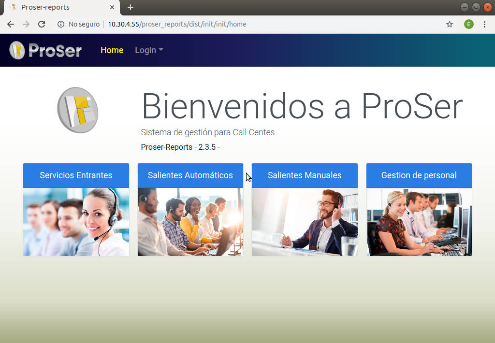
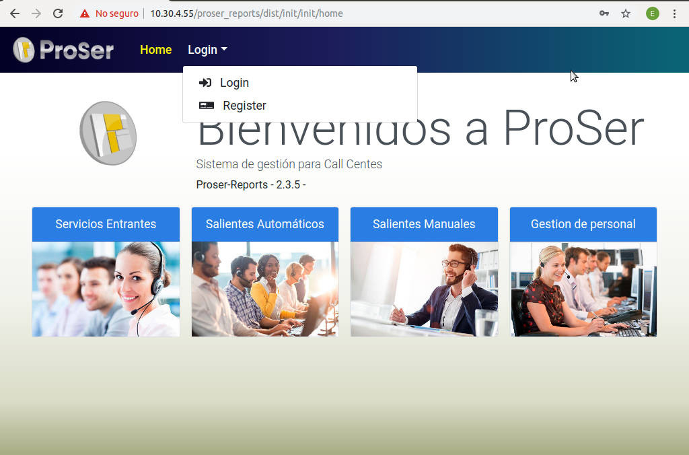
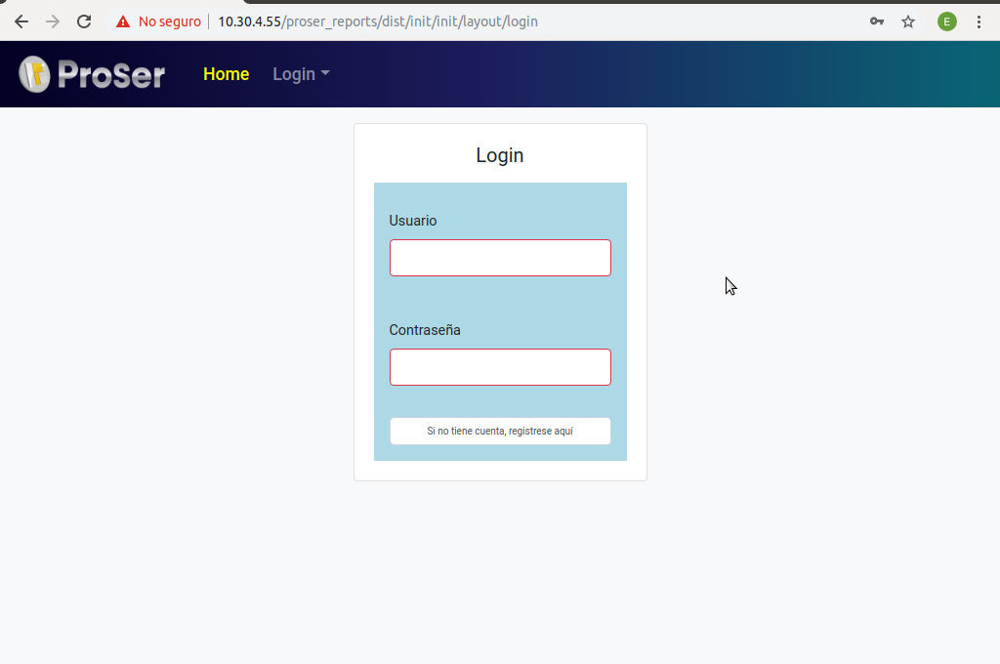
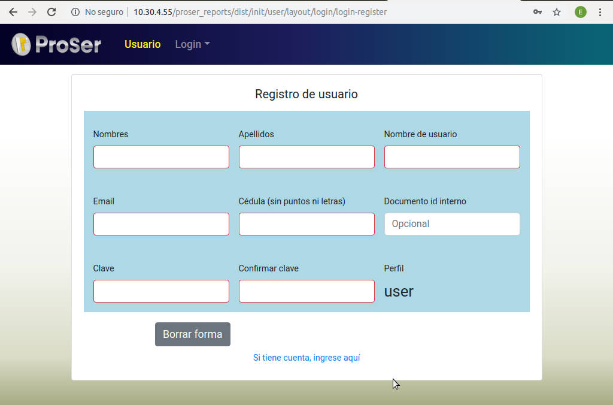
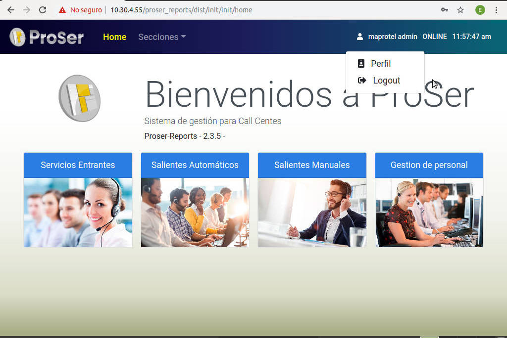
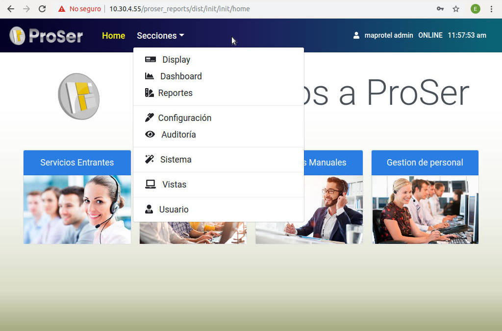

# 
 Manual de Usuario
 
* * *

En este manual, todos los usuarios podran conocer como usar nuestra aplicación Proser.

## Bienvenidos a Proser

En la imagen podemos ver la pagina principal de la aplicación proser. Contiene un texto de Bienvenida y la versioón de proser reports. 

En la parte superior se encuenta el menu en donde esta el home y el login, en donde los usuarios pueden loguearse o registrarse en el caso de no tener una cuenta en la aplicación.

## Login y Register

En la ventana de login aparecera lo siguiente:

* Pedira tu usario y tu clave en el caso de que ya te hayas registrado. Y más abajo te dice aparece un boton gris que dice "si no tienes cuenta, registrese aqui", el cual te llevara a la ventana de registro.

En la ventana de register, aparecera lo siguiente y deberas llenar varios campos para lograr tu registro:

* Tus nombres y apellidos, nombre de usuario, email, tu cédula sin colocarle ni puntos ni comas, el documento id interno pero eso es opcional (es decir, si no lo tienes no lo coloques, no es obligatorio), luego debes colocar tu calve y confirmarla.

* Más abajo aparece un boton gris que dice borrar forma, el cual borrara todo lo que has rellenado si le das click y si asi lo prefieres. Y un poco más abajo aparece un enlace que dice "si tienes cuenta ingrese aqui", esto es para aquellos que ya se registraron y si le das click te llevara a la ventana de login.

* Si llenas bien todos los campos obligatorios, aparecera al lado derecho un boton verde que dice Registrar, al darle click estaras registrado.

## Home

Al momento de ya estar registrado o logueado aparecera la siguiente ventana, muy parecido a la del principio de entrar a la aplicación, pero con algunas diferencias:

* En el menu en vez de aparecer Login, dice Secciones y en el lado derecho aparece el nombre de usuario, además dice que se encuentra ONLINE, y la hora actual la cual transcurre como un reloj.

* Al darle click a tu nombre de usuario aparecera un menu desplegable con las opciones de perfil y de logout(cerrar sesión).

### Secciones
 En las Secciones podemos ver todas las funciones o secciones que dispone la aplicación de proser.

* El Display.
* El Dashboard
* Los Reportes.
* La Configuración.
* La Auditoría.
* El Sistema.
* Las Vistas.
* El Usuario.

Cada una con una funcionalidad en específica y una información determinada y uso diferente. Que veremos a continuación con más detalle.

 

